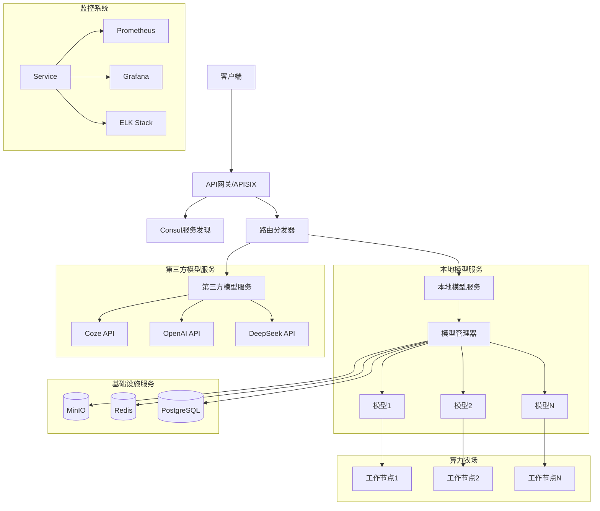

# AI服务系统架构设计

## 1. 整体架构

### 1.1 系统架构图

### 1.2 核心组件说明

#### 1.2.1 API网关层
- APISIX网关
  - 统一的API入口
  - 请求认证和鉴权
  - 流量控制和限流
  - 请求路由分发
- Consul服务发现
  - 服务注册
  - 健康检查
  - 配置管理
  - 服务发现

#### 1.2.2 路由分发器
- 根据请求特征进行路由
- 支持意图识别
- 动态路由策略
- 负载均衡

#### 1.2.3 本地模型服务
- 模型管理器
  - 模型生命周期管理
  - 资源调度
  - 健康检查
  - 自动扩缩容
- 模型实例
  - 独立运行环境
  - 资源隔离
  - 性能监控
  - 错误处理

#### 1.2.4 第三方模型服务
- API适配器
- Token管理
- 请求限流
- 错误重试
- 结果标准化

#### 1.2.5 算力农场
- 基于Ray框架实现
- 分布式计算支持
- 动态资源分配
- 故障转移
- 负载均衡

#### 1.2.6 基础设施服务
- MinIO对象存储
  - 模型文件存储
  - 版本管理
  - 访问控制
- Redis缓存
  - 会话管理
  - 结果缓存
  - 消息队列
- PostgreSQL数据库
  - 元数据存储
  - 配置管理
  - 状态追踪

## 2. 技术选型

### 2.1 核心框架
- FastAPI: Web框架
- Ray: 分布式计算框架
- Docker: 容器化
- Kubernetes: 容器编排
- Redis: 缓存和消息队列

### 2.2 模型部署
- ONNX Runtime: 模型推理
- PyTorch: 深度学习框架
- Transformers: 预训练模型

### 2.3 监控和运维
- Prometheus: 监控系统
- Grafana: 可视化面板
- ELK: 日志管理

## 3. 关键设计决策

### 3.1 服务集成
1. 网关集成
   - 使用APISIX作为API网关
   - 统一的认证和鉴权
   - 请求路由和负载均衡
   - 监控和日志收集

2. 基础设施集成
   - 使用MinIO存储模型文件
   - 使用Redis进行缓存
   - 使用PostgreSQL存储元数据
   - 共享配置中心

### 3.2 模型部署策略
1. 容器化部署
   - 每个模型独立容器
   - 资源隔离
   - 环境一致性
   - 快速部署和回滚

2. 动态扩缩容
   - 基于资源使用率
   - 基于请求量
   - 基于业务优先级

### 3.3 算力农场设计
1. 基于Ray框架
   - 分布式计算支持
   - 动态资源分配
   - 容错和恢复
   - 任务调度

2. 资源管理
   - GPU资源池化
   - 内存管理
   - 网络带宽控制
   - 存储管理

### 3.4 高可用设计
1. 服务冗余
   - 多实例部署
   - 故障转移
   - 负载均衡

2. 数据备份
   - 模型文件备份
   - 配置备份
   - 状态备份

## 4. 扩展性设计

### 4.1 水平扩展
- 服务无状态化
- 动态扩缩容
- 负载均衡
- 分布式部署

### 4.2 垂直扩展
- 模型优化
- 资源升级
- 性能调优
- 架构优化

## 5. 安全设计

### 5.1 认证授权
- JWT认证
- API密钥管理
- 访问控制
- 权限管理

### 5.2 数据安全
- 传输加密
- 存储加密
- 敏感信息保护
- 审计日志

## 6. 监控告警

### 6.1 系统监控
- 服务健康检查
- 资源使用监控
- 性能指标监控
- 业务指标监控

### 6.2 告警机制
- 多级告警
- 告警抑制
- 告警升级
- 告警通知 