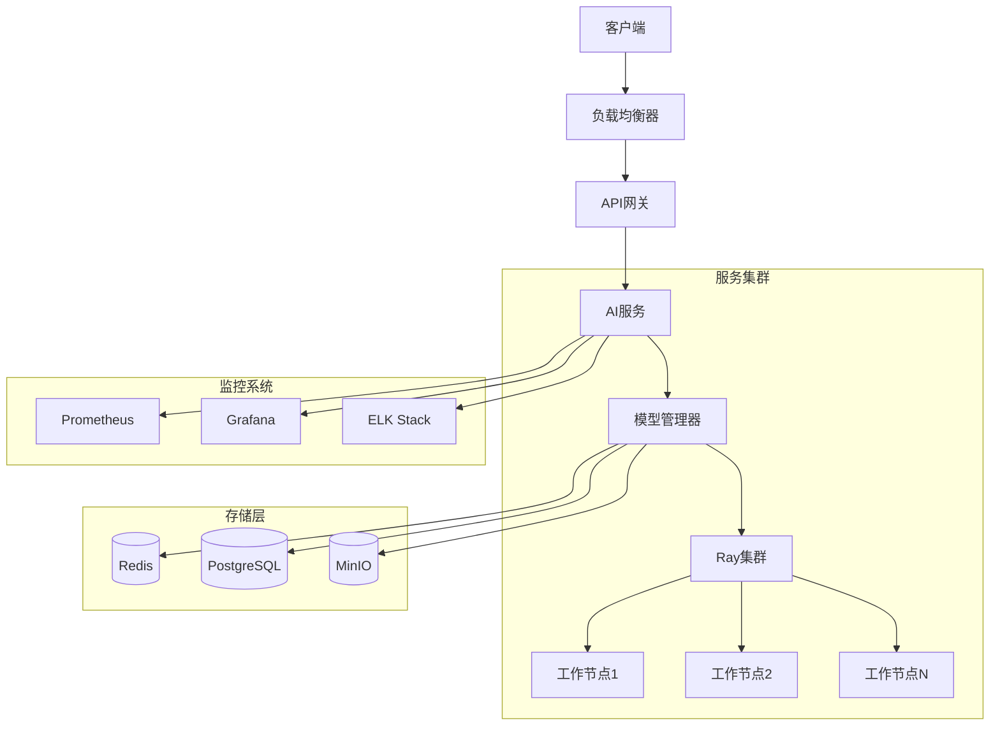

# AI服务部署架构设计

## 1. 部署架构概述

### 1.1 整体架构



### 1.2 组件说明

#### 1.2.1 负载均衡层
- Nginx/HAProxy
- SSL终止
- 请求分发
- 健康检查

#### 1.2.2 服务层
- FastAPI应用服务
- API网关
- 模型管理器
- Ray集群

#### 1.2.3 存储层
- Redis: 缓存和消息队列
- PostgreSQL: 元数据存储
- MinIO: 模型文件存储

#### 1.2.4 监控层
- Prometheus: 指标收集
- Grafana: 可视化
- ELK: 日志管理

## 2. 部署策略

### 2.1 容器化部署

#### 2.1.1 基础镜像
```dockerfile
# 基础Python环境
FROM python:3.9-slim

# 安装系统依赖
RUN apt-get update && apt-get install -y \
    build-essential \
    && rm -rf /var/lib/apt/lists/*

# 设置工作目录
WORKDIR /app

# 安装Python依赖
COPY requirements.txt .
RUN pip install -r requirements.txt

# 复制应用代码
COPY . .
```

#### 2.1.2 服务编排
```yaml
# Kubernetes部署配置
apiVersion: apps/v1
kind: Deployment
metadata:
  name: ai-service
spec:
  replicas: 3
  selector:
    matchLabels:
      app: ai-service
  template:
    metadata:
      labels:
        app: ai-service
    spec:
      containers:
      - name: ai-service
        image: ai-service:latest
        ports:
        - containerPort: 8000
        resources:
          limits:
            cpu: "2"
            memory: "4Gi"
            nvidia.com/gpu: "1"
          requests:
            cpu: "1"
            memory: "2Gi"
            nvidia.com/gpu: "1"
```

### 2.2 Ray集群部署

#### 2.2.1 集群配置
```yaml
# Ray集群配置
apiVersion: ray.io/v1alpha1
kind: RayCluster
metadata:
  name: ray-cluster
spec:
  head:
    serviceType: ClusterIP
    replicas: 1
    rayStartParams:
      dashboard-host: '0.0.0.0'
      num-cpus: '4'
      num-gpus: '1'
  workers:
    replicas: 3
    rayStartParams:
      num-cpus: '4'
      num-gpus: '1'
```

#### 2.2.2 资源管理
- GPU资源池化
- 动态扩缩容
- 负载均衡
- 故障转移

### 2.3 模型部署策略

#### 2.3.1 模型容器化
```dockerfile
# 模型服务镜像
FROM ai-service-base:latest

# 复制模型文件
COPY models/ /app/models/

# 设置环境变量
ENV MODEL_PATH=/app/models
ENV CUDA_VISIBLE_DEVICES=0

# 启动模型服务
CMD ["python", "model_server.py"]
```

#### 2.3.2 模型服务编排
```yaml
# 模型服务部署配置
apiVersion: apps/v1
kind: Deployment
metadata:
  name: model-service
spec:
  replicas: 2
  selector:
    matchLabels:
      app: model-service
  template:
    metadata:
      labels:
        app: model-service
    spec:
      containers:
      - name: model-service
        image: model-service:latest
        ports:
        - containerPort: 8001
        resources:
          limits:
            nvidia.com/gpu: "1"
          requests:
            nvidia.com/gpu: "1"
```

## 3. 高可用设计

### 3.1 服务高可用
- 多副本部署
- 健康检查
- 自动故障转移
- 负载均衡

### 3.2 数据高可用
- 数据备份
- 故障恢复
- 数据一致性
- 状态同步

## 4. 监控和运维

### 4.1 监控指标
- 服务健康状态
- 资源使用率
- 请求延迟
- 错误率
- 模型性能

### 4.2 告警策略
- 服务异常告警
- 资源不足告警
- 性能下降告警
- 安全事件告警

### 4.3 日志管理
- 应用日志
- 系统日志
- 访问日志
- 错误日志

## 5. 安全设计

### 5.1 网络安全
- SSL/TLS加密
- 防火墙规则
- 访问控制
- DDoS防护

### 5.2 数据安全
- 数据加密
- 访问权限
- 审计日志
- 备份恢复

## 6. 扩展性设计

### 6.1 水平扩展
- 服务扩容
- 数据分片
- 负载均衡
- 资源池化

### 6.2 垂直扩展
- 资源升级
- 性能优化
- 架构优化
- 模型优化 