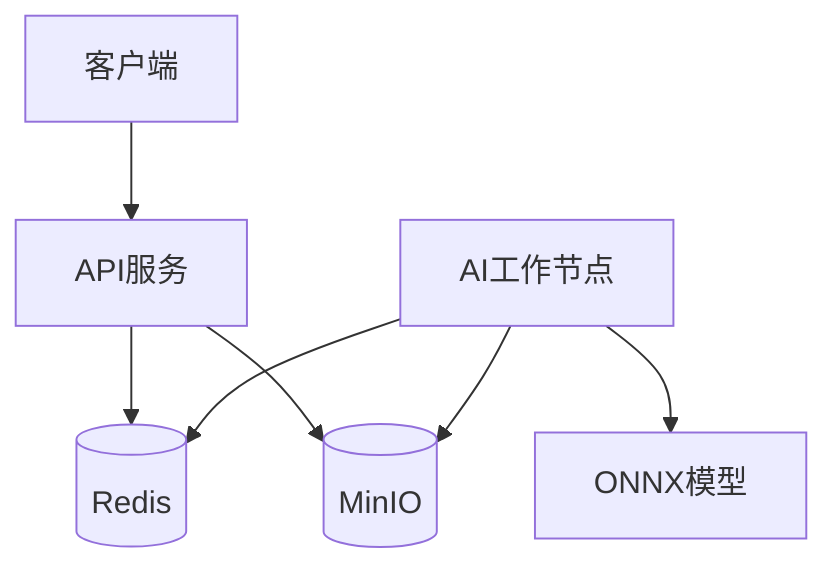

# 图像分割服务示例

## 1. 功能概述

本示例展示如何实现一个基于ONNX模型的图像分割服务，包括：
- 分布式任务处理
- 异步任务执行
- 结果存储和获取
- 错误处理和超时机制

## 2. 系统架构



## 3. 数据流程

1. 任务提交
   - 客户端上传图片到MinIO
   - 创建任务记录并存入Redis
   - 返回任务ID给客户端

2. 任务处理
   - AI工作节点监听Redis队列
   - 获取任务并下载图片
   - 执行模型推理
   - 保存结果到MinIO

3. 结果获取
   - 客户端轮询任务状态
   - 获取结果图片URL
   - 处理超时和错误情况

## 4. API接口

### 4.1 提交任务
```http
POST /api/v1/tasks/segmentation
Content-Type: multipart/form-data

file: <图片文件>
```

响应：
```json
{
    "task_id": "string",
    "status": "pending",
    "created_at": "timestamp"
}
```

### 4.2 查询任务状态
```http
GET /api/v1/tasks/{task_id}
```

响应：
```json
{
    "task_id": "string",
    "status": "string",  // pending, processing, completed, failed
    "result": {
        "segmented_image_url": "string",
        "mask_image_url": "string"
    },
    "error": "string",  // 如果失败
    "created_at": "timestamp",
    "completed_at": "timestamp"
}
```

## 5. 实现细节

### 5.1 任务状态
- PENDING: 任务已创建
- PROCESSING: 任务处理中
- COMPLETED: 任务完成
- FAILED: 任务失败

### 5.2 超时设置
- 任务处理超时：300秒
- 客户端轮询间隔：2秒
- 最大轮询次数：150次（5分钟）

### 5.3 存储结构
- MinIO Bucket: ai-segmentation
  - input/: 输入图片
  - output/: 分割结果
  - masks/: 遮罩图片

### 5.4 错误处理
- 图片格式错误
- 模型加载失败
- 推理过程异常
- 存储服务异常

## 6. 部署说明

### 6.1 环境要求
- Python 3.9+
- Redis 6.0+
- MinIO
- ONNX Runtime

### 6.2 配置项
```python
# 配置示例
config = {
    "redis": {
        "host": "localhost",
        "port": 6379,
        "db": 0
    },
    "minio": {
        "endpoint": "localhost:9000",
        "access_key": "minioadmin",
        "secret_key": "minioadmin",
        "bucket": "ai-segmentation"
    },
    "model": {
        "path": "models/segmentation.onnx",
        "input_size": [256, 256]
    },
    "task": {
        "timeout": 300,
        "poll_interval": 2,
        "max_polls": 150
    }
}
```

## 7. 使用示例

### 7.1 提交任务
```python
import requests

# 上传图片
files = {'file': open('image.jpg', 'rb')}
response = requests.post('http://localhost:8000/api/v1/tasks/segmentation', files=files)
task_id = response.json()['task_id']
```

### 7.2 轮询结果
```python
import time

def poll_result(task_id, max_polls=150):
    for _ in range(max_polls):
        response = requests.get(f'http://localhost:8000/api/v1/tasks/{task_id}')
        data = response.json()
        
        if data['status'] == 'completed':
            return data['result']
        elif data['status'] == 'failed':
            raise Exception(data['error'])
            
        time.sleep(2)
    
    raise TimeoutError("Task polling timeout")

# 获取结果
result = poll_result(task_id)
print(f"Segmented image: {result['segmented_image_url']}")
print(f"Mask image: {result['mask_image_url']}")
``` 